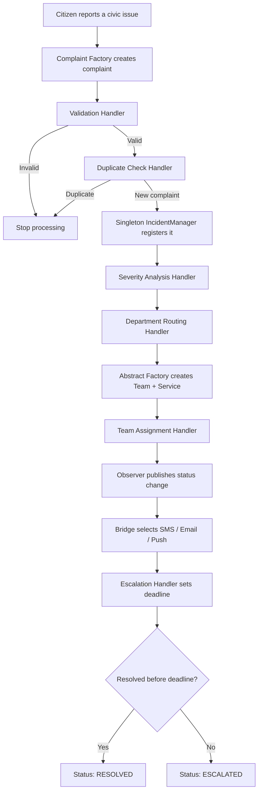
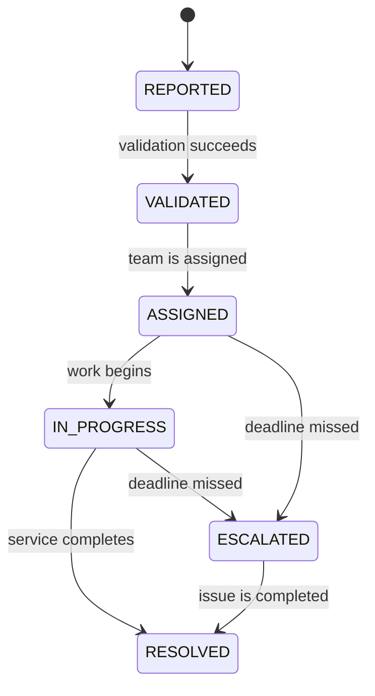

<a id="readme-top"></a>

<div align="center">

# 🏙️ Smart Civic Issue Response & Escalation System

### A beginner-friendly Java project demonstrating six classic design patterns


<p>
  Create, validate, route, assign, notify, track, and escalate civic complaints—
  while keeping every design-pattern responsibility easy to identify and explain.
</p>

[Explore the patterns](#-the-six-design-patterns) •
[Follow the full flow](#-end-to-end-program-flow) •
[View the UML](#-uml-class-diagram) •
[Run the project](#-getting-started) •


</div>

---

## 📌 Table of contents

1. [About the project](#-about-the-project)
2. [Features](#-features)
3. [End-to-end program flow](#-end-to-end-program-flow)
4. [UML class diagram](#-uml-class-diagram)
5. [The six design patterns](#-the-six-design-patterns)
6. [Example complaint journey](#-example-complaint-journey)
7. [Risk and severity model](#-risk-and-severity-model)
8. [Department routing](#-department-routing)
9. [Status and escalation lifecycle](#-status-and-escalation-lifecycle)
10. [Project structure](#-project-structure)
11. [Getting started](#-getting-started)
12. [Code examples](#-important-code-examples)
13. [Viva quick reference](#-viva-quick-reference)
14. [Academic scope](#-academic-scope-and-limitations)

---

## 🌟 About the project

The **Smart Civic Issue Response & Escalation System** models how a city authority
could process complaints reported by citizens. Supported issues include potholes,
water leakage, garbage overflow, broken streetlights, damaged traffic signals,
open manholes, and road flooding.

The project focuses on demonstrating **exactly six design patterns** in simple,
readable Java:

| # | Design pattern | Main responsibility |
|:-:|---|---|
| 1 | **Factory** | Creates the correct type of complaint |
| 2 | **Abstract Factory** | Creates a matching department team and service |
| 3 | **Chain of Responsibility** | Processes a complaint through ordered handlers |
| 4 | **Observer** | Reacts automatically to complaint status changes |
| 5 | **Bridge** | Separates notification purpose from delivery channel |
| 6 | **Singleton** | Maintains one central incident manager |

> [!IMPORTANT]
> This is an academic console application. Its main goal is to make the six
> patterns visible, correct, and easy to explain—not to act as a production civic
> portal.

For a pattern-by-pattern discussion of the problem, solution, participating
classes, and viva explanation, see [DESIGN_PATTERNS.md](DESIGN_PATTERNS.md).

---

## ✨ Features

- [x] Creates seven concrete types of civic complaints
- [x] Validates complaint description and location
- [x] Detects duplicates across processing chains
- [x] Calculates a simple risk score and severity level
- [x] Routes each issue to the responsible department
- [x] Creates a matching department team and service
- [x] Notifies citizens, administrators, and assigned teams
- [x] Supports SMS, email, and push notification channels
- [x] Tracks complaint lifecycle statuses
- [x] Assigns severity-based resolution deadlines
- [x] Escalates overdue unresolved complaints
- [x] Stores incidents in one central manager

### Supported complaint types

| Enum value | Concrete complaint class | Example |
|---|---|---|
| `POTHOLE` | `PotholeComplaint` | Deep pothole on a main road |
| `WATER_LEAKAGE` | `WaterLeakageComplaint` | Broken public water pipe |
| `GARBAGE` | `GarbageComplaint` | Overflowing community bin |
| `STREETLIGHT` | `StreetlightComplaint` | Streetlight not working |
| `TRAFFIC_SIGNAL` | `TrafficSignalComplaint` | Damaged traffic signal |
| `OPEN_MANHOLE` | `OpenManholeComplaint` | Uncovered manhole near a school |
| `ROAD_FLOODING` | `RoadFloodingComplaint` | Road blocked by rainwater |

---

## 🔄 End-to-end program flow



The six patterns do not operate as unrelated examples. They cooperate during
complaint processing:

```text
Factory → Chain → Singleton → Abstract Factory → Observer → Bridge → Escalation
```

---

## 🧱 UML class diagram

The complete class diagram shows the interfaces, abstract classes, concrete
implementations, and relationships used across all six design patterns.

> [!TIP]
> The diagram is intentionally wide. Click it to open the original SVG, then zoom
> in to inspect individual classes and relationships without losing image quality.

<div align="center">
  <a href="docs/diagrams/complaint-management-class-diagram.svg">
    
  </a>
</div>

<p align="center">
  <a href="docs/diagrams/complaint-management-class-diagram.svg"><strong>Open full-size SVG</strong></a>
  &nbsp;•&nbsp;
  <a href="docs/diagrams/complaint-management-class-diagram.mmd"><strong>View editable Mermaid source</strong></a>
</p>

The editable `.mmd` source can be opened in a Mermaid-compatible editor whenever
the project structure changes. The SVG is used in the README because it remains
clear at any zoom level.

---

## 🧩 The six design patterns

<details open>
<summary><strong>1. Factory Pattern — complaint creation</strong></summary>

### Problem

The client should not contain `new PotholeComplaint(...)`,
`new GarbageComplaint(...)`, and similar construction decisions everywhere.

### Solution

The client passes a `ComplaintType` to `ComplaintFactory`.
`CivicComplaintFactory` returns the correct `Complaint` subclass.

```java
ComplaintFactory factory = new CivicComplaintFactory();

Complaint complaint = factory.createComplaint(
        ComplaintType.OPEN_MANHOLE,
        3001L,
        "Dangerous open manhole near a school",
        "University Road"
);
```

**Key classes:** `ComplaintFactory`, `CivicComplaintFactory`, `Complaint`,
`ComplaintType`, and the seven concrete complaint classes.

</details>

<details>
<summary><strong>2. Abstract Factory Pattern — department resources</strong></summary>

### Problem

Once a department is selected, its team and service must belong to the same
family. A road complaint should not accidentally receive a water team and an
electrical service.

### Solution

Every `DepartmentFactory` creates two related products: a `Team` and a `Service`.

| Concrete factory | Team product | Service product |
|---|---|---|
| `RoadDepartmentFactory` | `RoadRepairTeam` | `RoadRepairService` |
| `WaterDepartmentFactory` | `WaterRepairTeam` | `WaterRepairService` |
| `SanitationDepartmentFactory` | `SanitationTeam` | `SanitationService` |
| `ElectricalDepartmentFactory` | `ElectricalTeam` | `ElectricalService` |
| `TrafficDepartmentFactory` | `TrafficTeam` | `TrafficService` |

**Key interfaces:** `DepartmentFactory`, `Team`, and `Service`.

</details>

<details>
<summary><strong>3. Chain of Responsibility — processing pipeline</strong></summary>

### Problem

Putting validation, duplicate detection, severity calculation, routing, assignment,
and escalation inside one large class would make the workflow difficult to change
and explain.

### Solution

Each `Handler` performs one task and passes the complaint to the next handler.

```text
ValidationHandler
      ↓
DuplicateCheckHandler
      ↓
SeverityAnalysisHandler
      ↓
DepartmentRoutingHandler
      ↓
TeamAssignmentHandler
      ↓
EscalationHandler
```

Validation and duplicate detection can stop the chain early. All other accepted
complaints continue through the complete pipeline.

</details>

<details>
<summary><strong>4. Observer Pattern — automatic status updates</strong></summary>

### Problem

The citizen, admin, and assigned team all need updates, but `Complaint` should not
contain separate manual calls for every interested party.

### Solution

Observers register with `ComplaintSubject`. When `Complaint.setStatus()` changes
the status, the subject calls every observer automatically.

```text
Complaint status changes
        ├── CitizenObserver.update(...)
        ├── AdminObserver.update(...)
        └── TeamObserver.update(...)
```

**Key classes:** `Observer`, `ComplaintSubject`, `CitizenObserver`,
`AdminObserver`, and `TeamObserver`.

</details>

<details>
<summary><strong>5. Bridge Pattern — notification delivery</strong></summary>

### Problem

Notification purpose and delivery channel are two independent dimensions.
Creating a class for every combination would cause unnecessary duplication.

### Solution

`Notification` represents who the message is for, while `NotificationSender`
represents how it is sent.

| Notification abstraction | Possible sender implementations |
|---|---|
| `CitizenNotification` | `SmsSender`, `EmailSender`, `PushSender` |
| `AdminNotification` | `SmsSender`, `EmailSender`, `PushSender` |
| `TeamNotification` | `SmsSender`, `EmailSender`, `PushSender` |

```java
Notification citizenSms = new CitizenNotification(new SmsSender());
Notification citizenEmail = new CitizenNotification(new EmailSender());
```

Changing `SmsSender` to `EmailSender` does not require changing the citizen
notification class.

</details>

<details>
<summary><strong>6. Singleton Pattern — central incident management</strong></summary>

### Problem

Multiple incident managers could hold different complaint lists and produce
inconsistent duplicate checks, statuses, and escalation data.

### Solution

`IncidentManager` has a private constructor and exposes one application-wide
instance through `getInstance()`.

```java
IncidentManager first = IncidentManager.getInstance();
IncidentManager second = IncidentManager.getInstance();

System.out.println(first == second); // true
```

It centrally manages registration, retrieval, duplicate checking, status changes,
complaint lists, and escalation information.

</details>

---

## 🚧 Example complaint journey

Consider this report:

> **“Dangerous open manhole near a school with heavy traffic.”**  
> Location: **University Road**

| Step | System action | Result |
|:-:|---|---|
| 1 | Factory creates the complaint | `OpenManholeComplaint` |
| 2 | Validation checks required information | Valid |
| 3 | Singleton-backed duplicate check runs | New complaint; registered |
| 4 | Severity handler calculates risk | `40 + 30 + 20 = 90` |
| 5 | Risk score is converted to severity | `CRITICAL` |
| 6 | Routing handler chooses department | Road Department |
| 7 | Abstract Factory creates related products | Road Repair Team + Service |
| 8 | Team assignment changes status | `ASSIGNED` |
| 9 | Observers react to the status change | Citizen, admin, and team updated |
| 10 | Bridge delivers the messages | SMS, email, and push |
| 11 | Escalation handler sets deadline | 4 hours |
| 12 | Deadline is missed while unresolved | Escalated to Supervisor |

---

## ⚠️ Risk and severity model

### Risk-score additions

| Risk condition | Score added |
|---|---:|
| Open manhole | `+40` |
| Near a school | `+30` |
| Heavy traffic | `+20` |
| Road flooding or rain | `+10` |

The final score is capped at `100`.

### Severity and deadline

| Risk score | Severity | Resolution deadline |
|---:|:---:|---:|
| `0–30` | 🟢 `LOW` | 48 hours |
| `31–60` | 🟡 `MEDIUM` | 24 hours |
| `61–80` | 🟠 `HIGH` | 12 hours |
| `81–100` | 🔴 `CRITICAL` | 4 hours |

> [!NOTE]
> The risk rules are deliberately small and transparent so a student can calculate
> and explain the result during a viva.

---

## 🏢 Department routing

| Complaint type | Responsible department | Assigned product family |
|---|---|---|
| Pothole | Road | Road Repair Team + Service |
| Open manhole | Road | Road Repair Team + Service |
| Road flooding | Road | Road Repair Team + Service |
| Water leakage | Water | Water Repair Team + Service |
| Garbage | Sanitation | Sanitation Team + Service |
| Broken streetlight | Electrical | Electrical Team + Service |
| Damaged traffic signal | Traffic | Traffic Team + Service |

---

## 📈 Status and escalation lifecycle

### Complaint statuses



### Escalation ladder

```text
TEAM_MEMBER → SUPERVISOR → DEPARTMENT_HEAD → ADMIN
```

Each overdue check advances an unresolved complaint by one level, up to `ADMIN`.
Because escalation changes the complaint status, registered observers are notified
through the same Observer + Bridge mechanism.

---

## 🗂️ Project structure

```text
CivicAware/
├── README.md
├── DESIGN_PATTERNS.md
├── docs/
│   └── diagrams/
│       ├── complaint-management-class-diagram.svg
│       └── complaint-management-class-diagram.mmd
└── src/
    ├── Main.java
    ├── Factory/
    │   ├── Complaint.java
    │   ├── ComplaintFactory.java
    │   ├── CivicComplaintFactory.java
    │   ├── ComplaintType.java
    │   ├── ComplaintStatus.java
    │   ├── SeverityLevel.java
    │   ├── EscalationLevel.java
    │   └── *Complaint.java
    ├── AbstractFactory/
    │   ├── DepartmentFactory.java
    │   ├── Team.java
    │   ├── Service.java
    │   ├── *DepartmentFactory.java
    │   ├── *Team.java
    │   └── *Service.java
    ├── ChainOfResponsibility/
    │   ├── Handler.java
    │   ├── ComplaintProcessingChain.java
    │   └── *Handler.java
    ├── Observer/
    │   ├── Observer.java
    │   ├── ComplaintSubject.java
    │   └── *Observer.java
    ├── Bridge/
    │   ├── Notification.java
    │   ├── NotificationSender.java
    │   ├── *Notification.java
    │   └── *Sender.java
    └── Singleton/
        └── IncidentManager.java
```

---

## 🚀 Getting started

### Prerequisites

- **JDK 17 or newer**
- A terminal, or an IDE such as **IntelliJ IDEA**
- No external libraries, build tools, database, or network connection required

Check Java installation:

```powershell
java -version
javac -version
```

### Option A — Run with IntelliJ IDEA

1. Open the `CivicAware` folder in IntelliJ IDEA.
2. Confirm that a JDK is selected under **Project Structure → Project SDK**.
3. Open `src/Main.java`.
4. Run the `Main.main()` method.
5. Inspect the console sections numbered `1` through `6`.

### Option B — Run from PowerShell

From the project root:

```powershell
New-Item -ItemType Directory -Force -Path out | Out-Null

javac -d out `
  (Get-ChildItem -Path src -Filter '*.java' -Recurse |
    ForEach-Object { $_.FullName })

java -cp out Main
```

### Option C — Run from Bash

```bash
mkdir -p out
javac -d out $(find src -name "*.java")
java -cp out Main
```

### Expected console sections

```text
SMART CIVIC ISSUE RESPONSE & ESCALATION SYSTEM

1. Factory Pattern demonstration
2. Abstract Factory Pattern demonstration
3. Chain of Responsibility Pattern demonstration
4. Observer Pattern demonstration
5. Bridge Pattern demonstration
6. Singleton Pattern demonstration
```

<details>
<summary><strong>Example notification output</strong></summary>

```text
[SMS] Citizen notification: Aarav: complaint #4001 is now ASSIGNED
[EMAIL] Admin notification: Central Control Room: complaint #4001 is now ASSIGNED
[PUSH] Team notification: Water Repair Team: complaint #4001 is now ASSIGNED
```

</details>

---

## 💻 Important code examples

### Build and execute the processing chain

```java
Handler processingChain = ComplaintProcessingChain.createChain();
processingChain.handle(complaint);
```

### Add observers with different Bridge combinations

```java
complaint.addObserver(new CitizenObserver(
        "Aarav",
        new CitizenNotification(new SmsSender())
));

complaint.addObserver(new AdminObserver(
        "Central Control Room",
        new AdminNotification(new EmailSender())
));
```

### Update status centrally

```java
IncidentManager manager = IncidentManager.getInstance();
manager.updateComplaintStatus(6001L, ComplaintStatus.IN_PROGRESS);
manager.updateComplaintStatus(6001L, ComplaintStatus.RESOLVED);
```

### Simulate an overdue complaint in the academic demo

```java
complaint.setResolutionDeadline(LocalDateTime.now().minusMinutes(1));
ComplaintProcessingChain.checkEscalation(complaint);
```

---

## 🧪 Suggested manual demonstrations

Try these during a presentation or viva:

1. Change `ComplaintType.OPEN_MANHOLE` to another type and show the Factory result.
2. Submit two complaints with identical type, description, and location to show
   duplicate stopping.
3. Add the words `school` and `heavy traffic` to show the risk score increase.
4. Replace `new SmsSender()` with `new EmailSender()` without changing the
   notification abstraction.
5. Compare two calls to `IncidentManager.getInstance()` using `==`.
6. Set a deadline in the past and run `checkEscalation()`.

---

## 🧭 Academic scope and limitations

This version intentionally keeps infrastructure simple:

- Complaint data is stored **in memory** and resets when the application stops.
- SMS, email, and push senders **print simulated messages** to the console.
- Automatic escalation is exposed as a clear `checkEscalation()` method; the demo
  does not run a permanent background scheduler.
- Duplicate detection uses normalized type, description, and location values.
- The application currently uses a console demonstration instead of a GUI or web
  API.
- No database, authentication, mapping service, or external notification provider
  is included.

These choices keep attention on the six required patterns and make the code easier
for a college team to present, divide, and explain.

---

<div align="center">

### 🏛️ Better civic response through clear software design

Built as an academic Java design-pattern demonstration.

**[Back to top](#readme-top)**

</div>
